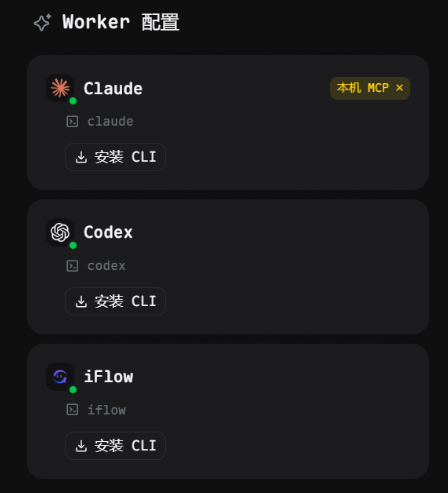

# Maple

Maple 是一个面向本地工程的 AI 工作台（自带 MCP & Skills）

简化你的开发工作流并提供开发和验收全流程提醒 & 可视化，适合 Notion 爱好者，项目经理，初级和中级开发者，多项目开发，中小级项目以及快速迭代

1. 创建需求提单
2. 点击执行
3. 等待 AI 报告验收

你可以在执行的过程中更方便地描述需求，以类似 Notion + Vibe-kanban + Cli 的交互体验完成 SDD 开发

重要的是，每次完成都会提醒你验收（待验收的报告会打黄色标记）

> 目前正处于快速迭代期，Windows 侧容易出现 BUG，可在 Q 群 1087691477 交流反馈

## 如何使用

1. 打开 Maple Desktop，创建项目并选择你的代码目录。
2. 配置并选择一个 Worker 执行工作

完成之后黄色问号 + 提醒验收

### Worker 选择建议

- 国外模型：Claude Opus 4.6 > GPT‑5.2 > GPT‑5.3 Codex
- 国内模型：建议安装 iFlow 后选择 GLM‑5

### 安装 CLI

在 Worker 卡片点击「安装 CLI」，复制命令到终端执行。
安装完成后，点击按钮右侧的「刷新」重新检测。

### 安装 MCP

当 CLI 已检测到后，点击「安装 MCP」完成注册：

- Maple 会为对应 Worker 写入 skills/commands 配置
- 并注册内置 MCP 服务：`http://localhost:45819/mcp`
- Windows 上若出现系统授权弹窗，请允许继续（仅在需要时触发）

### 执行任务

1. 在看板里新建任务，或从已完成的需要返工的任务详情页点击返工
2. 点击「执行待办」开始执行
3. 若任务进入「需要更多信息」，补充详情后点击「已补充信息」将其恢复为「待办」

## 常见问题

> 目前 Maple 刚刚起步，SDD 部分还需要探索如何更好实现支持。幸运的是，如果不算 BUG 的话（很快就能解决），已经可以作为一个不错的 AI 看板 & 执行工具了！

- **CLI 未检测到**：确认已安装，并在 Worker 卡片点击「刷新」
- **Windows / WSL**：若在 WSL 安装 CLI，请在对应 Worker 的 WSL 行安装 MCP
- **已阻塞需要继续处理**：在任务详情页点击「返工」，将任务标记为「待返工」再继续执行

## Why Maple

- **为什么不直接用 CLI**：是的！你可以用 tmux、hapi、happy、cursor 等等各种你喜欢的工作方式，做这样一个工具只是一次抛砖引玉！
- **为什么不用 Notion / Linear**：notion 部分 api 需要企业用户，而且很难做到在 notion 上直接 hook code agent cli，制作这个软件的灵感之一就是 notion 管理任务，可以看到我们在 notion 做的早期实践 https://github.com/parallized/notion-project-tracker
