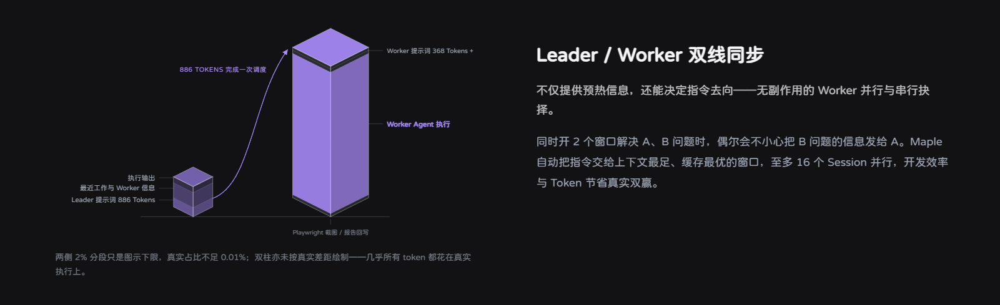

<div align="center">

# MapleCode

**Agentic AI 调度的崭新思路**

坚守愿景，你的品味决定什么值得被创造，<br/>
MapleCode 决定创造的秩序。

[](https://github.com/parallized/maple/stargazers)
[](https://maplecode.art)

[官网 · 在线 Demo 预览](https://maplecode.art) · [进入控制台](https://maplecode.art) · [使用文档](docs/server-cli.md)

</div>

💭 Agentic AI 调度新思路，多工具自编排，Leader / Worker 双轨信息同步，Token 与时间效益倒转。全平台多租户多工作区在线协作，可选自动截图报告回写，散步都能休闲 Vibe Coding。

MapleCode 规划工作、梳理依赖，并把每项任务分配给 Codex、Claude、DeepSeek，以及你已经在使用的编码 Agent。


## 能力亮点

需要各种工具解决不同问题？Maple 帮你编排，激发所有现代 Agent 潜能。

Maple 使用最优雅的方式同时适配无限种 CLI / GUI，像操作系统大一统软件一样，管理你的所有开发工具。

**任务内置详细报告和进行状态**

拒绝线性对话。任务中途断连、需要返工等信息，都由看板一网打尽。

**Leader / Worker 双线同步**

不仅提供预热信息，还能决定指令去向——无副作用的 Worker 并行与串行抉择。同时开 2 个窗口解决 A、B 问题时，偶尔会不小心把 B 问题的信息发给 A。Maple 自动把指令交给上下文最足、缓存最优的窗口，至多 16 个 Session 并行，开发效率与 Token 节省真实双赢。



**原生、随时随地、多设备、多人协作**

打开 CLI 作为 Runner 常驻开发机，Web 看板在服务端。手机和浏览器都能随时随地加任务、查状态，支持多租户与多工作区，结合 Playwright 可直观验收。


**克制的安全模型**

Runner Token 保持最小权限，密码经 Argon2id 哈希，云端 Provider 凭证以 AES-256-GCM 加密——你的数据安全非常重要。Maple 项目启动之初即完整支持自部署、一键离线使用、数据自持。

**杜绝污染硬盘管理**

所有缓存与数据统一收在 `~/.maple`，项目目录拒绝残留。Playwright 上传截图后自动销毁——保护你的数据，也避免污染硬盘。

## 使用

目前你可以选择 2 种形式使用 Maple，取决于你是否需要多平台、随地使用、多人协作等功能

- 本地运行：数据完全自持，响应速度快，没有安全套件，端口不开放无需在线和多人协作的情况下使用
- 自行部署服务器或使用 Maple 官方测试服务器：有安全套件，支持多租户，多平台，随时随地使用

Maple 依赖于你本机的各种 AI 服务包括 Codex, Claude 等等，建议在安装 Maple 期间把 AI 服务调通

### 本地运行

1. 安装 Maple（同一安装脚本会同时安装 CLI 与本地一体版，期间可询问是否安装 Playwright 截图功能）

Windows：

```powershell
irm https://maplecode.art/install.ps1 | iex
```

macOS / Linux：

```sh
curl -fsSL https://maplecode.art/install.sh | sh
```

2. 运行 `maple-local` 启动本地服务，在弹出的浏览器页面直接进入看板开始工作

### 客户端 + 服务端

1. 安装 Maple CLI

```powershell
irm https://maplecode.art/install.ps1 | iex

curl -fsSL https://maplecode.art/install.sh | sh
```

2. 登录 MapleCode 官方，并绑定你的 CLI 至工作区

- 运行 `maple` 后，CLI 会打开浏览器。登录并确认后，当前工作区将获得这台 CLI；不要确认来源不明的请求。

3. 在网页添加业务和需求，Maple CLI 将会自动分发、拉起 Worker 执行并截图结果

> 忘记掉 Claude, Codex, Kimi, Gemini, Grok...忘记掉上下文窗口，忘记掉缓存，忘记掉切 Provider 还要重启终端，把精力专注在手头的任务上，在业务播种与收获中全力以赴地享受

## 关键信息

- 你可能不喜欢完成任务以后自动截图：可以在设置里关闭
- 截图太模糊了，我是 4K 屏看着难受：可以在设置里调高清。截图太高清了，硬盘受不了，可以在设置里调糊
- 我不喜欢那种污染硬盘管理的软件，到处创建小东西找都找不到：Maple 相关缓存都在 ~/.maple 里面，理论上删掉 ~/.maple 一切大吉，截图上传成功后会尝试自我毁灭

## 要求

- 硬盘：Bun + Maple CLI bundle 大约 400M 占用，如果使用 Playwright 截图功能大约总和 1G 占用

---

<div align="center">

别再把时间花在整理任务、切换 Agent 和追问进度上。<br/>
Maple 会规划工作、梳理依赖，把任务交给合适的 Coding Agent，并汇总结果与验收——让你专注于真正值得创造的事。

**为那些想法比窗口更多的人而造。**

</div>
