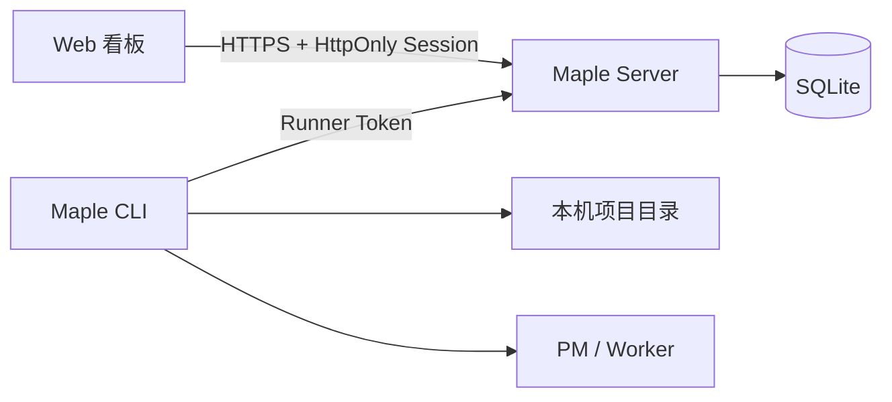
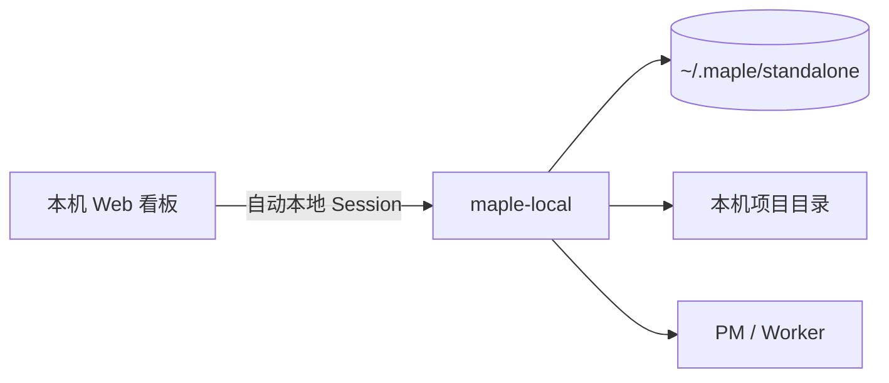

# Maple 在线服务与 Worker CLI

Maple Server 同时提供 Web 看板、账户与工作区 API、SQLite 数据层和 CLI 安装包。CLI 常驻开发机，保存本机项目路径、领取任务并启动 PM/Worker。项目源码和 Worker 凭据不会上传到 Server。



## Maple Local 本地一体版

`maple-local` 是额外发行入口，复用同一套 Server、Web 看板和 Runner，不是另一套实现：



- Server 固定绑定 `127.0.0.1`，不接受外部 Server 地址。
- 首次启动自动创建唯一的本机用户和工作区，不注册、不登录、不设置密码。
- Runner Token 只在进程内部签发，不开放 OAuth、配对和额外工作区创建入口。
- 本地版使用 `maple_standalone_session` Cookie 与独立配置目录，不覆盖联网版状态。
- 构建产物位于 `apps/cli/dist/standalone`，其中包含入口、WebUI 和 Sharp 原生运行库。

用户一键安装：

```sh
curl -fsSL https://maple.example.com/install-local.sh | sh
```

```powershell
irm https://maple.example.com/install-local.ps1 | iex
```

安装完成后直接运行 `maple-local`。安装器会把 Server、WebUI、CLI 和当前系统的 Sharp 原生库放在 `~/.maple`，不会在项目目录安装依赖。发布构建命令为：

后续更新前退出正在运行的 Maple Local，然后执行 `maple-local update`。更新器会复用首次安装时保存的可信下载地址，原子替换程序文件并保留 `~/.maple/standalone` 中的数据。

仓库内开发时只需运行 `bun local`：它会启动支持热重载的 WebUI 与 Standalone，自动签发并连接本机 Runner，然后打开已登录的 Dashboard。WebUI 变更由 Vite 即时更新，Server 与 CLI 变更由 Bun 自动重启；无需再启动其他命令，也没有登录、OAuth 或配对步骤。

```bash
bun run --filter @maple/cli build:standalone
```

## 本地开发

```bash
bun install
bun run server
```

`bun run server` 会为本次进程构建独立部署到 `~/.maple/server/runtime`，不会运行或清理可能被其他进程占用的 `apps/server/dist`。重复执行时如果目标地址已有 Maple Server，会直接提示服务已运行；异常退出遗留的部署目录会在下次启动时自动清理。

打开 `http://127.0.0.1:45820` 注册账户。另开终端运行：

```bash
bun dev
```

CLI 会打开浏览器授权页。登录后确认，当前工作区立即获得该 CLI；开发配置保存在 `~/.maple/cli-dev`。之后 `bun dev` 会复用 Runner Token。

## CLI 授权

生产安装：

```powershell
irm https://maple.example.com/install.ps1 | iex
```

```sh
curl -fsSL https://maple.example.com/install.sh | sh
```

连接时不输入工作区、设备名、项目权限或配对码：

```bash
maple connect --server https://maple.example.com
```

CLI 创建带 PKCE 的短期设备授权，打开浏览器并轮询。用户确认后，Server 把 Runner 归入当前工作区；设备码只能交换一次 Runner Token。Runner Token 只能心跳、管理自身项目映射、领取自己的命令和执行任务，不能浏览工作区管理数据。

增加项目既可以在 CLI 中按 `E` 打开原生目录选择器，也可以由 Web 向指定在线 Runner 发出目录选择命令。绝对路径只保存在 `~/.maple/cli.json`：

```bash
maple project add .
maple project list
maple project remove <项目名或ID>
```

## 账户与工作区

- 注册自动创建第一个工作区；账户可以创建、切换和重命名更多工作区。
- 项目、Todo、Runner、设置和聚合用量均按 `workspace_id` 查询，不能依赖前端过滤。
- 密码使用 Argon2id；Web Session Token 与 Runner Token 只以 SHA-256 哈希保存。
- Web 使用 `HttpOnly`、`SameSite=Lax` Cookie，写请求同时验证 Origin 和旋转 CSRF Token。
- 登录按 IP 与邮箱持久限流，错误文案不区分账户是否存在。
- 新网络或新浏览器会进入 `review`，只能访问账户安全页；已信任设备批准后才可进入工作区。
- 修改密码会撤销其他登录；账户安全页可批准、移除设备并查看审计记录。
- CLI 授权、密码修改、会话批准/撤销都会写入 `security_events`。

Server 不再生成或接受 Admin Token。Web 管理操作必须使用账户 Session，CLI 只使用绑定后下发的 Runner Token。

## Maple Runtime

Skills、MCP、Playwright 和临时成果统一位于：

```text
~/.maple/runtime/
  skills/maple/SKILL.md
  mcp/mcp.json
  playwright/
  artifacts/
```

CLI 每次启动都会自检 Skill 与 MCP 配置。内置 `maple mcp` 只暴露当前进程角色、项目目录和 Skill 路径；任务流转继续使用 Runner API。Codex 与 Claude 通过本次进程参数加载 MCP，不修改 `.codex`、`.claude`、`.gemini`、`.iflow` 或 `.windsurf`。

Playwright 包、启动器和 Chromium 缓存均在 `~/.maple/runtime/playwright`，不会在项目目录生成依赖、配置或浏览器缓存。设置 `MAPLE_SKIP_PLAYWRIGHT_INSTALL=1` 可跳过安装。

## 公网部署

仓库提供 Docker、Compose 和 Caddy HTTPS 配置：

```bash
cp deploy/.env.example .env
# 修改 MAPLE_DOMAIN，并把 DNS 指向主机
docker compose up -d --build
```

Server 只在 Compose 内网暴露，Caddy 负责 TLS。必须备份 `maple-data` volume，其中包含 SQLite、头像和任务成果物。

关键环境变量：

| 变量 | 默认值 | 说明 |
| --- | --- | --- |
| `MAPLE_PUBLIC_URL` | 本机地址 | 外部 HTTPS 地址，也是 CLI 授权与安装链接的基址 |
| `MAPLE_ALLOWED_ORIGINS` | 本机 Vite 地址 | 允许携带 Cookie 的精确 Origin 列表 |
| `MAPLE_TRUST_PROXY` | `0` | 仅在可信反向代理隔离 Server 时设为 `1` |
| `MAPLE_SECURE_COOKIES` | HTTPS 自动开启 | 强制 Session Cookie 仅通过 HTTPS |
| `MAPLE_REGISTRATION_ENABLED` | `1` | 设为 `0` 可关闭新注册 |
| `MAPLE_SESSION_DAYS` | `30` | Web Session 有效期 |
| `MAPLE_DEVICE_AUTH_TTL_SECONDS` | `600` | CLI 浏览器授权有效期 |
| `MAPLE_DATA_DIR` | `~/.maple/server` | SQLite、头像和成果物目录 |
| `MAPLE_DATABASE_PATH` | `<data-dir>/maple.sqlite` | SQLite 文件位置，Windows/Linux/macOS 均支持 |

不要在没有可信代理边界时开启 `MAPLE_TRUST_PROXY`，否则攻击者可以伪造来源 IP 并绕过按 IP 的审查与限流。生产环境必须使用 HTTPS。

## 验证

```bash
bun run --filter '*' typecheck
bun test
```

完整 Server 构建包含后端、Web、CLI bundle 和两套在线安装脚本：

```bash
bun run --filter @maple/server build
```

正式构建会先写入同级暂存目录，全部产物完成后再替换 `dist`。发布失败时保留原部署，不会先删除正在使用的目录。
